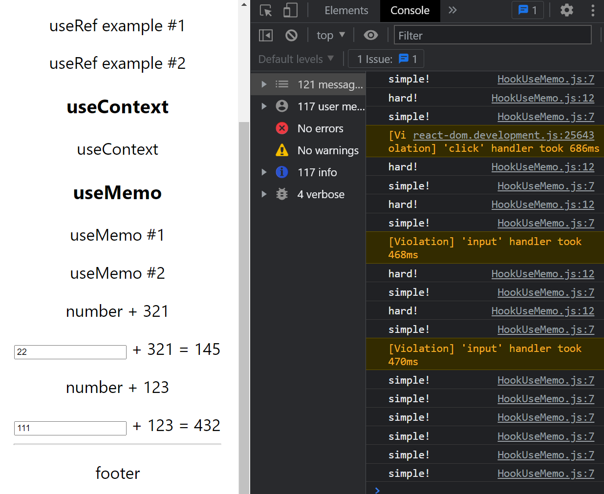
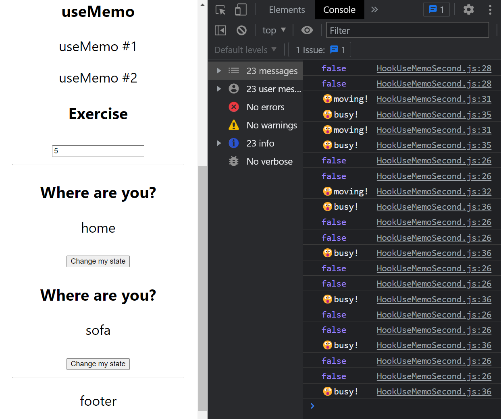
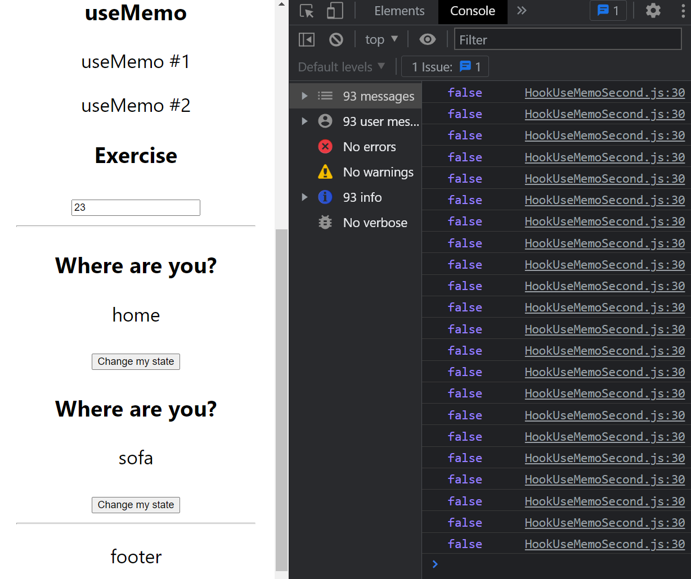
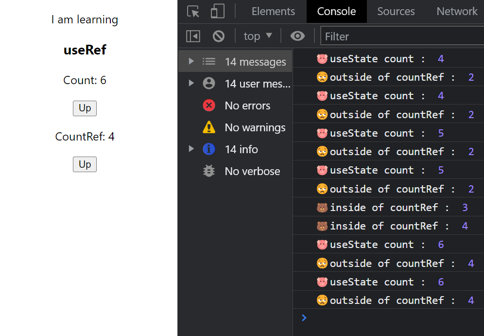
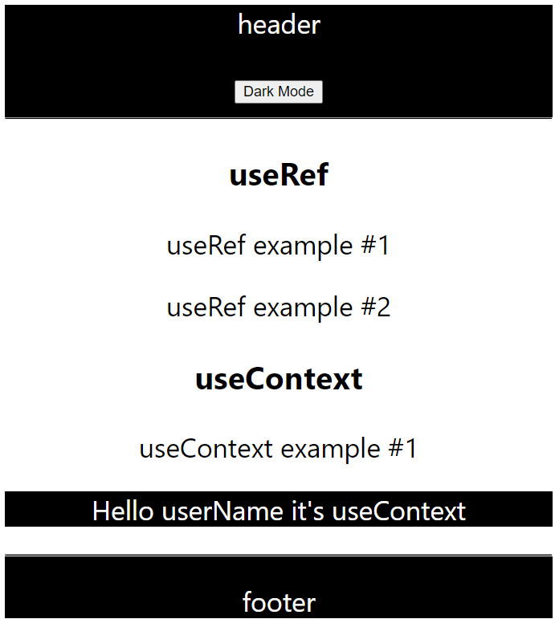

### intellij Eslint issue

npm install --g eslint

npm install eslint@8.22.0 --save-exact

[useMemo1](#usememo-1) |
[useMemo2](#usememo-2) |
[useRef1](#useref-1) |
[useRef2](#useref-2) |
[useContext](#usecontext)

## useMemo 1

Use useMemo when you don't want to call a heavy function whenever you change the others
It returns a memoized value.

    const simpleCalculate = (number) => {
        console.log('simple!')
        return number + 321
    };

    const hardCalculate = (number) => {
        console.log('hard!')
        for (let i = 0; i < 999999999; i++) {} // thinking time
        return number + 123
    }

    const [hardNumber, setHardNumber] = useState(0);
    const [easyNumber, setEasyNumber] = useState(0);

    // const hardSum = hardCalculate(hardNumber);
    // hard calculation is not re-loaded but only when hardNumber is called
    const hardSum = useMemo(()=> {
        return hardCalculate(hardNumber)
    }, [hardNumber])
    const simpleSum = simpleCalculate(easyNumber);

    const handleHardChange = (event) => {
        setHardNumber(parseInt(event.target.value))
    };

    const handleSimpleChange = (event) => {
        setEasyNumber(parseInt(event.target.value))
    };

Now even the number has changed, isLocation or isWork is not shown in console.

## useMemo 2

When it's object the object memory address is changed every time you re-render the page. 
It's good to put the object in useMemo to avoid re-address the memory whenever you refreshes.

    const work = useMemo(() => {
        return {
            work: isWork ? 'desk' : 'sofa'
        }
    }, [isWork])

    const location = isTravel ? 'somewhere' : 'home'
    // but if it's object?

    const work = {
        work: isWork ? 'desk' : 'sofa'
    }
    
    // it calls useEffect since object value changes its address in memory everytime.

## useRef 1

    const refContainer = useRef(initialValue);
    
    initialValue = 0 
    
    { current : 0 } <-- not reloaded/refreshed by its
    
    in JSX -> {refContainer.current} 
    
    returns 0

useRef is like a “box” that can hold a mutable value in its .current property.
Keep in mind that useRef does not notify you when its content changes.\
Mutating the .current property does not cause re-render. \
If you want to run some code when React attaches or detaches a ref to a DOM node, you may want to use a callback ref instead.

    const countRef = useRef(0);
    const [count, setCount] = useState(0);

    const increaseCountState = () => {
        setCount(count + 1)
    }

    const increaseCountRef = () => {
        countRef.current = countRef.current +1;
    }
    
    return (
        

            
Count: {count}

            <button onClick={increaseCountState}> Up</button>
            
CountRef: {countRef.current}

            <button onClick={increaseCountRef}> Up</button>
        

    )}

## useRef-2

focus on input.

    const HookUseRef2 = () => {
    const inputRef = useRef();
    
        useEffect(() => {
            console.log(inputRef)
            inputRef.current.focus();
        }, [])
    
        const welcomeMessage = () => {
            alert(`Welcome! ${inputRef.current.value}!`);
        }
    
    
        return (
            <>
                <input ref={inputRef} type="text" placeholder="username"/>
                <button onClick={welcomeMessage}>Login</button>
            </>
        )
    }

## useContext

in 'context' folder,

    import { createContext } from 'react';
    
    export const LearnUserContext = createContext(null);

in parent component/container

    const [isDark, setIsDark] = useState(false);
    const user = "userName"

    return (
        <LearnUserContext.Provider value={{isDark, setIsDark, user}}>
        

            <HookContainer/>
        

        </LearnUserContext.Provider>
    );

in child components(anywhere you want to use)

    const {isDark, user} = useContext(LearnUserContext)
    return (
        

            
Hello {user} it's useContext

        

    )

or in header

    const {isDark, setIsDark} = useContext(LearnUserContext)

    const toggleMode = () => {
        setIsDark(!isDark)
    }

    return (
        <header
        className="header"
        style={{
            backgroundColor: isDark ? 'black' : 'white',
            color          : isDark ? 'white' : 'black',
        }}>

            
header

            <button className="button" onClick={toggleMode}>Dark Mode</button>
            

        </header>
    )

# Getting Started with Create React App

This project was bootstrapped with [Create React App](https://github.com/facebook/create-react-app).

## Available Scripts

In the project directory, you can run:

### `npm start`

Runs the app in the development mode.\
Open [http://localhost:3000](http://localhost:3000) to view it in your browser.

The page will reload when you make changes.\
You may also see any lint errors in the console.

### `npm test`

Launches the test runner in the interactive watch mode.\
See the section about [running tests](https://facebook.github.io/create-react-app/docs/running-tests) for more information.

### `npm run build`

Builds the app for production to the `build` folder.\
It correctly bundles React in production mode and optimizes the build for the best performance.

The build is minified and the filenames include the hashes.\
Your app is ready to be deployed!

See the section about [deployment](https://facebook.github.io/create-react-app/docs/deployment) for more information.

### `npm run eject`

**Note: this is a one-way operation. Once you `eject`, you can't go back!**

If you aren't satisfied with the build tool and configuration choices, you can `eject` at any time. This command will remove the single build dependency from your project.

Instead, it will copy all the configuration files and the transitive dependencies (webpack, Babel, ESLint ... ) right into your project, so you have full control over them. All the commands except `eject` will still work, but they will point to the copied scripts, so you can tweak them. At this point you're on your own.

You don't have to ever use `eject`. The curated feature set is suitable for small and middle deployments, and you shouldn't feel obligated to use this feature. However, we understand that this tool wouldn't be useful if you could not customize it when you are ready for it.

## Learn More

You can learn more in the [Create React App documentation](https://facebook.github.io/create-react-app/docs/getting-started).

To learn React, check out the [React documentation](https://reactjs.org/).

### Code Splitting

This section has moved here: [https://facebook.github.io/create-react-app/docs/code-splitting](https://facebook.github.io/create-react-app/docs/code-splitting)

### Analyzing the Bundle Size

This section has moved here: [https://facebook.github.io/create-react-app/docs/analyzing-the-bundle-size](https://facebook.github.io/create-react-app/docs/analyzing-the-bundle-size)

### Making a Progressive Web App

This section has moved here: [https://facebook.github.io/create-react-app/docs/making-a-progressive-web-app](https://facebook.github.io/create-react-app/docs/making-a-progressive-web-app)

### Advanced Configuration

This section has moved here: [https://facebook.github.io/create-react-app/docs/advanced-configuration](https://facebook.github.io/create-react-app/docs/advanced-configuration)

### Deployment

This section has moved here: [https://facebook.github.io/create-react-app/docs/deployment](https://facebook.github.io/create-react-app/docs/deployment)

### `npm run build` fails to minify

This section has moved here: [https://facebook.github.io/create-react-app/docs/troubleshooting#npm-run-build-fails-to-minify](https://facebook.github.io/create-react-app/docs/troubleshooting#npm-run-build-fails-to-minify)
